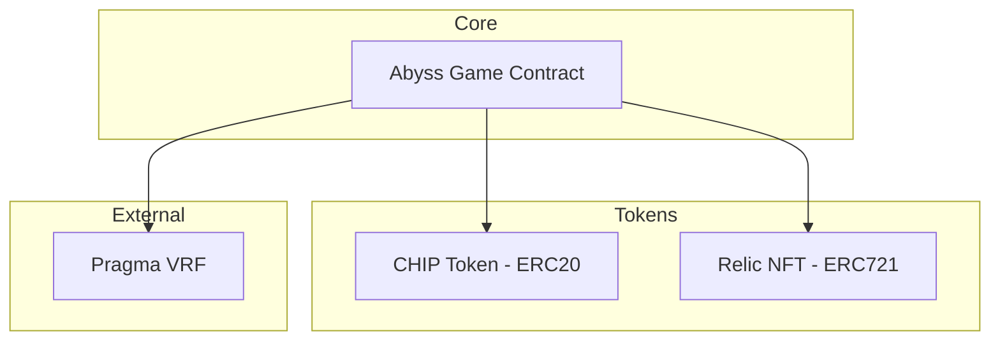

## Contract Architecture

Abyss is built on **three main contracts** deployed on Starknet:



## 1. Abyss Game Contract

The main game logic contract handling:

### Core Features
- **Session Management** - Create, play, and end game sessions
- **Spin Mechanics** - Request spins, process results via VRF
- **Scoring System** - Calculate scores based on patterns and items
- **Leaderboard** - Track and rank player scores
- **Prize Pool** - Manage and distribute prize tokens

### Key Functions

```cairo
// Session Management
fn create_session(is_competitive: bool) -> u32;
fn end_session(session_id: u32);
fn get_session_data(session_id: u32) -> GameSession;

// Gameplay
fn request_spin(session_id: u32);
fn buy_item(session_id: u32, slot: u8);
fn refresh_market(session_id: u32);

// Relics
fn equip_relic(session_id: u32, relic_token_id: u256);
fn activate_relic(session_id: u32);

// Leaderboard & Prizes
fn submit_score(session_id: u32);
fn get_leaderboard_entry(rank: u32) -> LeaderboardEntry;
fn distribute_prizes();
```

### Storage Structure

```cairo
#[storage]
struct Storage {
    // Sessions
    sessions: Map<u32, GameSession>,
    session_count: u32,
    
    // Player data
    player_sessions: Map<ContractAddress, List<u32>>,
    
    // Market
    market_items: Map<(u32, u8), u32>,  // (session, slot) -> item_id
    
    // Leaderboard
    leaderboard: Map<u32, LeaderboardEntry>,  // rank -> entry
    leaderboard_count: u32,
    
    // Prize Pool
    prize_tokens: Map<u32, ContractAddress>,
    prize_tokens_count: u32,
    
    // External contracts
    relic_nft_address: ContractAddress,
    chip_token_address: ContractAddress,
    vrf_provider_address: ContractAddress,
}
```

## 2. CHIP Token Contract

Standard **ERC20** token with additional game integrations:

```cairo
#[starknet::contract]
mod ChipToken {
    use openzeppelin::token::erc20::ERC20Component;
    
    // Standard ERC20 implementation
    // with mint/burn capabilities for game mechanics
}
```

### Features
- Standard ERC20 transfers
- Minting by authorized game contract
- Burning for certain game actions

## 3. Relic NFT Contract

**ERC721** NFT collection with on-chain metadata:

```cairo
struct RelicMetadata {
    relic_id: u8,
    name: felt252,
    description: felt252,
    effect_type: u8,
    cooldown_spins: u32,
    image_uri: felt252,
}
```

### Key Functions

```cairo
// Standard ERC721
fn owner_of(token_id: u256) -> ContractAddress;
fn transfer_from(from, to, token_id);

// Relic-specific
fn get_relic_metadata(token_id: u256) -> RelicMetadata;
fn mint_relic(relic_id: u8, recipient: ContractAddress) -> u256;
fn get_relic_supply(relic_id: u8) -> u32;
```

## Upgradeability

All contracts implement the **OpenZeppelin Upgradeable** pattern:

```cairo
#[abi(embed_v0)]
impl UpgradeableImpl of IUpgradeable<ContractState> {
    fn upgrade(ref self: ContractState, new_class_hash: ClassHash) {
        self.ownable.assert_only_owner();
        self.upgradeable.upgrade(new_class_hash);
    }
}
```

This allows the admin to upgrade contract logic while preserving state.

## Security Considerations

### Access Control
- Admin-only functions protected by `assert_only_owner()`
- Session ownership verified for all player actions
- Relic ownership verified before equip

### Randomness
- All random values from Pragma VRF (see [VRF documentation](/technical/vrf))
- No on-chain pseudo-random that could be manipulated

### Reentrancy
- State changes happen before external calls
- Token transfers use safe patterns
