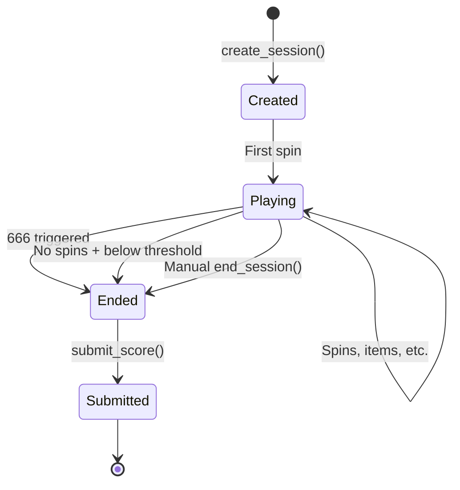

## Session Overview

A **game session** is the core unit of gameplay in Abyss. Each session:
- Has a unique session ID
- Belongs to a single player
- Tracks all game state (score, level, spins, items, etc.)
- Can be competitive (prize pool) or free play

## Session Lifecycle



## Creating a Session

### Function Signature
```cairo
fn create_session(
    ref self: ContractState, 
    is_competitive: bool
) -> u32
```

### Process
1. Generate new session ID
2. Initialize GameSession struct
3. If competitive: transfer CHIP deposit
4. Store session data
5. Add to player's session list
6. Return session ID

### Session Initialization
```cairo
let session = GameSession {
    session_id: new_id,
    player_address: caller,
    level: 1,
    score: 0,
    total_score: 0,
    spins_remaining: 5,
    is_competitive: is_competitive,
    is_active: true,
    created_at: get_block_timestamp(),
    equipped_relic: 0,
    relic_last_used_spin: 0,
    relic_pending_effect: 0,
    total_spins: 0,
};
```

## Session Data Structure

```cairo
#[derive(Drop, Serde, starknet::Store)]
struct GameSession {
    session_id: u32,
    player_address: ContractAddress,
    
    // Progress
    level: u32,
    score: u32,
    total_score: u32,  // Cumulative across levels
    spins_remaining: u32,
    total_spins: u32,
    
    // Session flags
    is_competitive: bool,
    is_active: bool,
    created_at: u64,
    
    // Relic state
    equipped_relic: u256,  // Token ID (0 = none)
    relic_last_used_spin: u32,
    relic_pending_effect: u8,
}
```

## Session Actions

### Spinning
```cairo
fn request_spin(ref self: ContractState, session_id: u32)
```
- Decrements `spins_remaining`
- Generates random grid via VRF
- Calculates patterns and score
- Applies relic effects
- Checks for 666 game over

### Buying Items
```cairo
fn buy_item(ref self: ContractState, session_id: u32, slot: u8)
```
- Deducts cost from `score`
- Adds item to session inventory
- Items persist until session ends

### Relic Actions
```cairo
fn equip_relic(ref self: ContractState, session_id: u32, token_id: u256)
fn activate_relic(ref self: ContractState, session_id: u32)
```
- Equip: Store relic token ID (once per session)
- Activate: Queue effect for next relevant action

## Session Ending

### Game Over Conditions

| Condition | Trigger | Effect |
|-----------|---------|--------|
| **666** | Three 6s in pattern | Immediate end, score = 0 |
| **No Spins** | spins = 0 AND score < threshold | Session ends |
| **Manual** | Player calls end_session | Voluntary end |

### End Session Function
```cairo
fn end_session(ref self: ContractState, session_id: u32)
```

1. Validate session is active and owned
2. Mark `is_active = false`
3. Finalize score
4. Update leaderboard if competitive

## Leaderboard Submission

For competitive sessions:

```cairo
fn submit_score(ref self: ContractState, session_id: u32)
```

1. Validate session ended
2. Compare score to leaderboard
3. Insert if qualifies for top positions
4. Shift lower rankings down

## Session Queries

### Get Session Data
```cairo
fn get_session_data(self: @ContractState, session_id: u32) -> GameSession
```

Returns complete session state.

### Get Player Sessions
```cairo
fn get_player_sessions(
    self: @ContractState, 
    player: ContractAddress
) -> Array<u32>
```

Returns all session IDs for a player.

### Get Last Spin Result
```cairo
fn get_last_spin_result(
    self: @ContractState, 
    session_id: u32
) -> SpinResult
```

Returns the most recent spin's grid, score, and patterns.

## Session Items

Items purchased during a session are stored separately:

```cairo
// Storage
session_items: Map<(u32, u32), SessionItem>  // (session_id, index) -> item
session_items_count: Map<u32, u32>  // session_id -> count

struct SessionItem {
    item_id: u32,
    quantity: u32,
}
```

Items are read during:
- Score calculation (bonuses)
- 666 check (La Biblia)
- Level up (spin bonuses)
