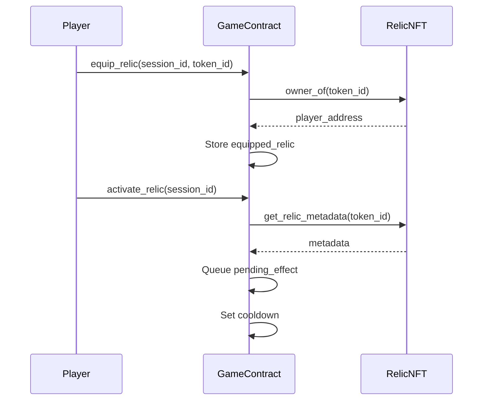

## What are Relics?

Relics are **ERC721 NFT tokens** that provide powerful special abilities during gameplay. Each relic has a unique effect that can dramatically change the outcome of your game.

## Acquiring Relics

Relics can be obtained by:
1. **Minting** - Use CHIP tokens to mint new relics from the Relic NFT contract
2. **Trading** - Buy/sell relics on NFT marketplaces (they're standard ERC721)
3. **Rewards** - Special events may distribute relics as prizes

## Using Relics in Game

### Equipping
- You can **equip one relic per session**
- Once equipped, a relic **cannot be changed** during that session
- Equipping does NOT activate the relic - it just makes it available

### Activating
- Click on your equipped relic to **activate its ability**
- The effect is **queued** and applies on your **next spin**
- After activation, a **cooldown** begins (measured in spins)

<Note>
Relic effects don't happen immediately - they trigger when you perform your next spin!
</Note>

## The Five Genesis Relics

### 1. Mortis
<Columns cols={2}>
  <div>
    
  </div>
  <div>
    **Force Random Jackpot**
    
    Your next spin forces a random jackpot pattern (all 15 symbols become the same).
    
    **Cooldown:** 10 spins
    
    **Strategy:** Use when you need a big score boost. The jackpot symbol is random.
  </div>
</Columns>

---

### 2. Phantom
<Columns cols={2}>
  <div>
    
  </div>
  <div>
    **Double Next Spin**
    
    Your next spin's score is **doubled**.
    
    **Cooldown:** 5 spins
    
    **Strategy:** Best used after setting up score bonuses with items.
  </div>
</Columns>

---

### 3. Lucky the Dealer
<Columns cols={2}>
  <div>
    
  </div>
  <div>
    **Trigger 666** ⚠️
    
    Forces a 666 result on next spin - **ends your game!**
    
    **Cooldown:** 8 spins
    
    **Strategy:** Use only if you have La Biblia item to survive.
  </div>
</Columns>

---

### 4. Scorcher
<Columns cols={2}>
  <div>
    
  </div>
  <div>
    **Reset Spins**
    
    Resets your spins remaining to **5**.
    
    **Cooldown:** 7 spins
    
    **Strategy:** Use when you're about to run out of spins but haven't reached threshold.
  </div>
</Columns>

---

### 5. Inferno
<Columns cols={2}>
  <div>
    
  </div>
  <div>
    **Free Market Refresh**
    
    Refresh the market items **for free** (normally costs points).
    
    **Cooldown:** 6 spins
    
    **Strategy:** Use when the market has bad items.
  </div>
</Columns>

## Relic Technical Details

### Contract Information
- **Standard:** ERC721 (fully tradeable)
- **Contract:** `Relic NFT Contract` on Starknet
- **Metadata:** On-chain (name, description, effect type, cooldown)

### On-Chain Metadata
Each relic stores:
```cairo
struct RelicMetadata {
    relic_id: u8,           // Unique relic type ID (1-5)
    name: felt252,          // "Mortis", "Phantom", etc.
    description: felt252,   // Effect description
    effect_type: u8,        // Effect ID for game logic
    cooldown_spins: u32,    // Cooldown in spins
    image_uri: felt252,     // IPFS URI for image
}
```

### Integration Flow

