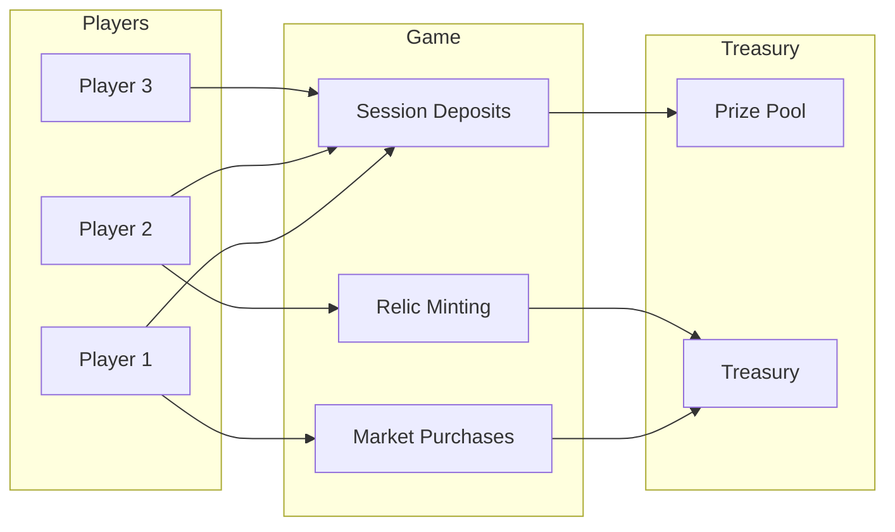

## CHIP Token

**CHIP** is the native ERC20 token of the Abyss ecosystem, used for all in-game transactions.

### Token Utility

| Use Case | Description |
|----------|-------------|
| **Session Entry** | Deposit CHIP to enter competitive sessions |
| **Market Purchases** | Buy items from the in-game market |
| **Relic Minting** | Mint new relic NFTs |
| **Prize Pool** | CHIP contributes to prize pool rewards |

## Token Flow

## Session Economics

### Entry Cost
- **Fixed price: $1 USD equivalent**
- Payable in: **ETH, STRK**, or other allowed ERC20 tokens
- Price calculated at time of session creation

### Prize Pool Distribution
- **50%** of each entry goes to the prize pool
- **50%** goes to the treasury/operations
- Top 5 players share the accumulated prize pool

## Market Economics

### Buying Items
- Items cost a portion of your **current session score**
- Score spent on items is permanent (doesn't return if session ends)
- Items provide bonuses only for the current session

### Market Refresh
- Refreshing the market for new items costs score
- The **Inferno relic** provides one free refresh

## Relic Minting

### Minting Cost
- Relics are minted by spending CHIP tokens
- Each relic type has a limited supply
- Minting cost may vary by relic rarity

### Secondary Market
- Relics are ERC721 NFTs and fully tradeable
- Players can buy/sell on any Starknet NFT marketplace

## Prize Distribution

### Multi-Token Support
The prize pool can hold multiple token types:
- **CHIP** - Native game token
- **ETH** - Ethereum
- **STRK** - Starknet token
- Additional tokens as added by admin

### Distribution Percentages
| Rank | Share |
|------|-------|
| 1st | 40% |
| 2nd | 25% |
| 3rd | 18% |
| 4th | 10% |
| 5th | 7% |

## Contract Addresses

<Note>
These are Starknet Sepolia testnet addresses. Mainnet addresses will be published at launch.
</Note>

| Contract | Purpose |
|----------|---------|
| **Abyss Game** | Main game logic, sessions, leaderboard |
| **CHIP Token** | ERC20 token contract |
| **Relic NFT** | ERC721 relic collection |

## Economic Sustainability

The Abyss economy is designed to be sustainable:

1. **Zero-sum prize pool** - Player deposits fund player rewards
2. **Market sinks** - Score spent on items is burned (not recoverable)
3. **Relic scarcity** - Limited supply creates collectible value
4. **Competitive incentive** - Prize pool motivates continued play
