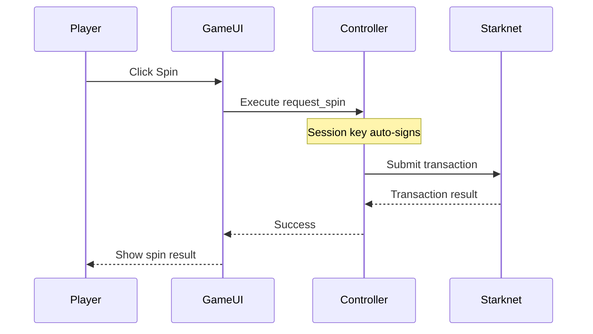

## What is Cartridge Controller?

**Cartridge Controller** is a smart wallet solution designed specifically for gaming on Starknet. It provides:

- **Session keys** - Sign transactions without popups
- **Social login** - Email, Google, Twitter authentication
- **Passkey support** - Biometric authentication
- **Custom UI theming** - Match your game's branding

## Why Cartridge Controller?

Traditional wallet experiences break gaming immersion:

| Problem | Cartridge Solution |
|---------|-------------------|
| Popup for every transaction | Session keys auto-sign |
| Complex seed phrases | Social login or passkeys |
| Generic wallet UI | Themed to match game |
| Slow transaction approval | Instant in-game signing |

## Integration in Abyss

### Session Policies

Abyss pre-approves specific contract calls so players don't need to confirm each action:

```typescript
const policies: SessionPolicies = {
    contracts: {
        [CONTRACTS.ABYSS_GAME]: {
            methods: [
                { name: "create_session", entrypoint: "create_session" },
                { name: "request_spin", entrypoint: "request_spin" },
                { name: "buy_item", entrypoint: "buy_item" },
                { name: "refresh_market", entrypoint: "refresh_market" },
                { name: "equip_relic", entrypoint: "equip_relic" },
                { name: "activate_relic", entrypoint: "activate_relic" },
                { name: "end_session", entrypoint: "end_session" },
            ]
        },
        [CONTRACTS.CHIP_TOKEN]: {
            methods: [
                { name: "approve", entrypoint: "approve" },
            ]
        }
    }
};
```

### Connector Setup

```typescript
import { ControllerConnector } from "@cartridge/connector";

const connector = new ControllerConnector({
    policies,
    rpc: "https://api.cartridge.gg/x/starknet/sepolia",
    theme: "abyss",
    colorMode: "dark",
    tokens: {
        erc20: [CONTRACTS.CHIP_TOKEN]
    }
});
```

## Player Experience

### First-Time Connection

1. Player clicks "Connect Wallet"
2. Cartridge modal opens (themed to Abyss)
3. Player chooses login method:
   - Email + password
   - Google account
   - Passkey (biometric)
4. Session established with pre-approved policies

### Gameplay Flow

Once connected, players can:
- **Spin** - No confirmation needed
- **Buy items** - Instant execution
- **Activate relics** - Seamless action
- **End session** - Quick confirmation



## Custom Theming

Abyss uses a custom theme for the Controller UI:

```typescript
const connector = new ControllerConnector({
    theme: "abyss",
    colorMode: "dark",
    // Theme includes:
    // - Orange accent colors (#FF841C)
    // - Custom logo
    // - Dark backgrounds
    // - Game-matching typography
});
```

## useController Hook

Abyss provides a custom hook for Controller integration:

```typescript
export function useController() {
    const { account, address, status } = useAccount();
    const { connect, disconnect, connectors } = useConnect();
    
    const controller = useMemo(() => 
        connectors.find((c) => c.id === "controller"),
        [connectors]
    );
    
    const username = useMemo(() => 
        controller?.username(),
        [controller]
    );
    
    const openProfile = () => controller?.openProfile("inventory");
    
    return {
        account,
        address,
        username,
        isConnected: status === "connected",
        isConnecting: status === "connecting",
        connect: () => connect({ connector: controller }),
        disconnect,
        openProfile,
    };
}
```

## Security

### Session Keys
- Limited to pre-approved contract methods
- Cannot transfer tokens arbitrarily
- Expire after inactivity

### Passkey Authentication
- Hardware-backed security
- No seed phrases to lose
- Biometric verification

### Account Abstraction
- Smart contract wallet
- Social recovery options
- Future-proof design

## Resources

- [Cartridge Documentation](https://docs.cartridge.gg)
- [Controller SDK](https://github.com/cartridge-gg/controller)
- [Starknet.js](https://www.starknetjs.com/)
