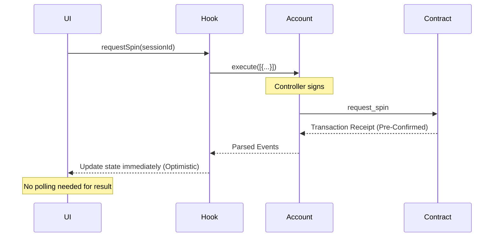

## Technology Stack

| Technology | Purpose |
|------------|---------|
| **Next.js 15** | React framework with App Router |
| **TypeScript** | Type-safe development |
| **Starknet.js** | Blockchain interaction |
| **Framer Motion** | Animations |
| **@cartridge/connector** | Wallet integration |

## Project Structure

```
web-app/
├── src/
│   ├── app/                 # Next.js App Router pages
│   │   ├── page.tsx        # Home page
│   │   ├── game/           # Game page
│   │   ├── sessions/       # Session management
│   │   ├── leaderboard/    # Rankings
│   │   └── relics/         # Relic shop
│   │
│   ├── components/          # React components
│   │   ├── SlotGrid.tsx    # 5x3 slot display
│   │   ├── PatternOverlay   # Pattern animations
│   │   ├── modals/         # Modal components
│   │   └── providers/      # Context providers
│   │
│   ├── hooks/              # Custom React hooks
│   │   ├── useController   # Cartridge integration
│   │   └── useGameContract # Contract interactions
│   │
│   └── utils/              # Utility functions
│       ├── abyssContract   # Contract calls
│       ├── patternDetector # Pattern logic
│       └── GameConfig      # Game constants
│
└── public/
    └── images/             # Game assets
```

## Key Components

### SlotGrid
Renders the 5×3 slot machine grid with spinning animations.

```tsx
<SlotGrid 
    grid={grid}           // Array of 15 symbol IDs
    isSpinning={spinning} // Trigger spin animation
/>
```

### PatternOverlay
Displays pattern match animations when patterns are detected.

```tsx
<PatternOverlay
    patterns={patterns}   // Detected patterns
    onPatternShow={() => playSound('win')}
/>
```

### Game Modals
- **MarketModal** - Buy items with score
- **InventoryModal** - View owned items
- **RelicModal** - Equip relics
- **InfoModal** - Game rules and info
- **PrizePoolModal** - Current prize pool

## Custom Hooks

### useController
Manages Cartridge Controller connection:

```typescript
const {
    account,        // Starknet account
    address,        // Wallet address
    username,       // Controller username
    isConnected,    // Connection status
    connect,        // Connect function
    disconnect,     // Disconnect function
    openProfile,    // Open Controller profile
} = useController();
```

### useAbyssGame
Provides contract interaction functions and manages optimistic state:

```typescript
const {
    requestSpin,
    getSessionData,
    buyItem,
    refreshMarket,
    optimisticItems,
    // ... more functions
} = useAbyssGame();
```

## State Management

Game state is managed with React hooks:

```typescript
// Core game state
const [score, setScore] = useState(0);
const [level, setLevel] = useState(1);
const [spinsRemaining, setSpinsRemaining] = useState(5);
const [grid, setGrid] = useState<number[]>([]);
const [isSpinning, setIsSpinning] = useState(false);

// Relic state
const [equippedRelic, setEquippedRelic] = useState(null);
const [relicCooldownRemaining, setRelicCooldownRemaining] = useState(0);
const [scoreMultiplier, setScoreMultiplier] = useState(1);
```

## Contract Interaction Flow



## Pattern Detection

Patterns are detected client-side for immediate feedback:

```typescript
const patterns = detectPatterns(grid, undefined, scoreBonuses);
```

The client calculation matches the contract logic exactly, but the **contract result is the source of truth** for scoring.

## Animation System

Uses Framer Motion for smooth animations:

- **Level Up** - Celebration animation
- **Pattern Highlights** - Box highlighting matched symbols
- **Score Popups** - Floating score numbers
- **Relic Activation** - Cinematic relic reveal
- **666 Game Over** - Dramatic game end

## Sound System

```typescript
const playSound = (sound: string, delay?: number) => {
    setTimeout(() => {
        const audio = new Audio(`/sounds/${sound}.mp3`);
        audio.play();
    }, delay || 0);
};
```

Sounds: spin, win, jackpot, game-over, level-up
