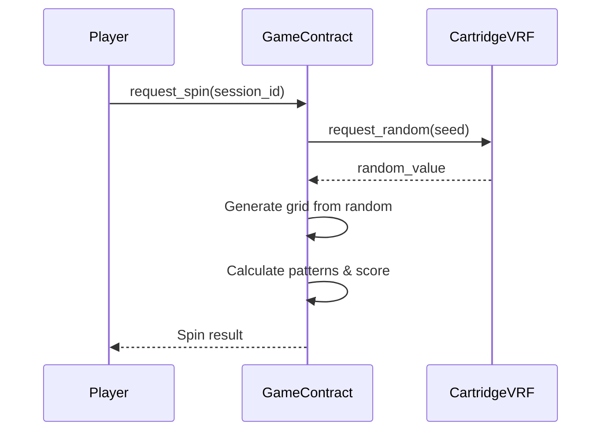

## Why VRF?

In a slot machine game, **randomness is critical**. Players need assurance that:
1. Results cannot be predicted
2. Results cannot be manipulated
3. Randomness is verifiable on-chain

Abyss uses **Cartridge VRF** (Verifiable Random Function) to achieve all three.

## How It Works

### Traditional vs VRF Randomness

| Approach | Problem |
|----------|---------|
| **Block hash** | Miners can manipulate |
| **Timestamp** | Predictable to some degree |
| **User seed** | User can choose favorable seeds |
| **VRF** ✅ | Unpredictable, unbiasable, verifiable |

### VRF Properties

1. **Unpredictable** - Output cannot be predicted before computation
2. **Deterministic** - Same input always produces same output
3. **Verifiable** - Anyone can verify the output is correct

## Integration with Cartridge

Cartridge VRF is built into the Cartridge Controller infrastructure, providing seamless integration for on-chain games.

### Benefits of Cartridge VRF
- **Native Starknet integration** - Designed for Cairo contracts
- **Low latency** - Fast random number generation
- **Session key compatible** - Works with Cartridge session keys
- **Battle-tested** - Used by multiple on-chain games

## Integration Flow



## Grid Generation

The random value is used to determine all 15 grid positions:

```cairo
fn generate_grid_from_random(random: u128) -> Array<u8> {
    let mut grid = ArrayTrait::new();
    let mut remaining = random;
    
    // Each cell uses portion of random bits
    let mut i = 0;
    while i < 15 {
        // Extract bits for this cell
        let cell_random = remaining % 100;
        remaining = remaining / 100;
        
        // Map to symbol based on probabilities
        let symbol = self.random_to_symbol(cell_random);
        grid.append(symbol);
        
        i += 1;
    }
    
    grid
}
```

### Symbol Probability Mapping

```cairo
fn random_to_symbol(self: @ContractState, random: u64) -> u8 {
    // Probabilities: Diamond 10%, Seven 15%, Cherry 20%, 
    //                Lemon 20%, Coin 25%, Six 10%
    if random < 10 { return SYMBOL_DIAMOND; }      // 0-9
    if random < 25 { return SYMBOL_SEVEN; }        // 10-24
    if random < 45 { return SYMBOL_CHERRY; }       // 25-44
    if random < 65 { return SYMBOL_LEMON; }        // 45-64
    if random < 90 { return SYMBOL_COIN; }         // 65-89
    return SYMBOL_SIX;                              // 90-99
}
```

## Verification

Any player can verify that:

1. **The random seed** was generated from immutable session data
2. **The VRF output** matches what Cartridge VRF would produce for that seed
3. **The grid** was correctly generated from the random value
4. **The score** was correctly calculated from the grid

This makes the entire game **provably fair** - no one, including the game operators, can manipulate results.

## Security Considerations

### Seed Generation
Seeds are generated from:
- Session ID
- Block timestamp
- Caller address
- Previous spin count

This ensures unique seeds for every spin.

### No Retry Attacks
Once a spin is requested, the result is determined by VRF output. Players cannot:
- Cancel and retry for better results
- Preview results before committing
- Influence the random generation

## Resources

- [Cartridge Documentation](https://docs.cartridge.gg)
- [Cartridge VRF Guide](https://docs.cartridge.gg/vrf)
